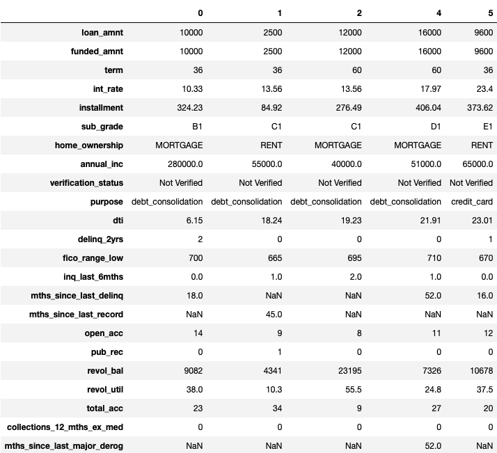

# Loan Default Predictor
A loan default predictor based on applicant information. 

Loan Default is the failure to repay a debt, including interest or principal, on a loan or security. Creditors calculate loan risk in advance but loan default is still a significant source of loss of revenue. Data from one creditor, LendingClub, shows that defaulted loans funded between 2012 and 2017 cost investors $471,319,912.18. Machine learning and predictive modeling could significantly reduce this loss and provide better returns on investment. 

# Table of Contents
1. [Data](#Data)
2. [Modeling](#Modeling)
3. [Results](#Results)
4. [Citations](#Citations)

## Data

The loan data for this project was downloaded from LendingClub but is no longer available as they no longer offer loan notes to individual investors. The loan data is from all loans from 20012 to March 2020 consisting of a total of 2,643,639 loans. Though earlier years were available, the volume was much lower and fewer features were available. Earlier years would also have been affected by the 2008 housing market crash which caused a reevaluation accross the industry of how loans were approved. 

The table below is a sample of rows and features available in the data set. Many features had a significant percentage of missing values, mostly due to the changes in data stored for each loan through the years. However I don't want to remove them as some may be strong indicators of default. Missing data will ge given a value of 0 and an additional dummy feature will be created indicating whether the value was missing or not. 

### Data Leakage
Of 126 columns, 55 were found to be