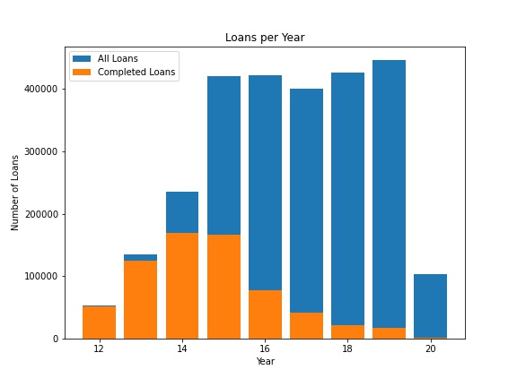

# Loan Default Predictor
A loan default predictor based on applicant information. 

Loan Default is the failure to repay a debt, including interest or principal, on a loan or security. Creditors calculate loan risk in advance but loan default is still a significant source of loss of revenue. Data from one creditor, LendingClub, shows that defaulted 3 year loans funded between 2012 and 2017 cost investors $471,319,912.18. Machine learning and predictive modeling could significantly reduce this loss and provide better returns on investment. 

# Table of Contents
1. [Data](#Data)
2. [Modeling](#Modeling)
3. [Results](#Results)

## Data

The loan data for this project was downloaded from LendingClub but is no longer available as they no longer offer loan notes to individual investors. The loan data is from all loans from 20012 to March 2020 consisting of a total of 2,643,639 loans. Though earlier years were available, the volume was much lower and fewer features were available. Earlier years would also have been affected by the 2008 housing market crash which caused a reevaluation accross the industry of how loans were approved. 

In order to avoid a skewed sample of data, only loans funded before 2015 will be considered so that those loans have the amount of time needed to complete. 

The table below is a sample of rows and features available in the data set. Many features had a significant percentage of missing values, mostly due to the changes in data stored for each loan through the years. However I don't want to remove them as some may be strong indicators of default. Missing data will ge given a value of 0 and an additional dummy feature will be created indicating whether the value was missing or not. 

Of 126 columns, 55 were found to be useful and avoid data leakage. Many features included data from after origination. Because I am looking to provide a tool to assist in the loan decision process, any features that have data gained after the loan has been funded will be dropped. 

## Modeling

Random Forest and Gradient Boosted classifiers from SciKitLearn were used to create classification models predicting loan default. Because of the imbalance in the dataset, accuracy will be a poor measure of model performance. Instead we will look at precision and the Area Under the Curve of the ROC plot. 

| Model            | ROC AUC     | Precision   | 
| ---------------- | ----------- | ----------- | 
| Random Forest    | 0.5142      | 0.6126      | 
| Gradient Boosted | 0.5200      | 0.6263      | 

From the ROC plot we see that increasing our true positive rate is also rapidly increasing our false positive rate. This is not ideal as rejecting loans that we predict will default can hurt future business if too many loans are rejected. 

We can also adjust the sensitivity of the model to increase precision or recall. 

Using a standard threshold of 0.5 to determine whether a loan will default has a very low recall. Lowering the threshold greatly increases the recall but also rapidly reduces the precision. Though a 62% precision does not seem high, lets inspect what this does to profit. 

## Results

In order to create a hypothetical profit curve I created a confusion matrix using averaged values for potential interest earned, and potential loss. In our modeling, we will assume that there will be no difference in action for those loans that will be predicted to be paid, so there will be no change in cost or benefit. For now we will reject loans that are predicted default. 

#### Cost Matrix
| Model            | Predicted Paid     | Predicted Default     | 
| ---------------- | ------------------ | --------------------- | 
| Actual Paid      | 0                  | -$1991 (lost interest)| 
| Actual Default   | 0                  | $8538 (funds saved)   | 

#### Confustion Matrix
As we change the threshold for what the model will consider a defaulted loan we will get a different confusion matrix. Below is the matrix for a threshold of 0.5. 

| Model            | Predicted Paid     | Predicted Default     | 
| ---------------- | ------------------ | --------------------- | 
| Actual Paid      | 71543              | 636                   | 
| Actual Default   | 20741              | 1066                  | 

We can show the profit curve this model will yield below. 

However, since we have actual loan data available with the amount collected for each loan, we can see how this model would have performed on the holdout data using actual dollar figures. 

Even with the model as it is, if emplemented could save potential millions. 

